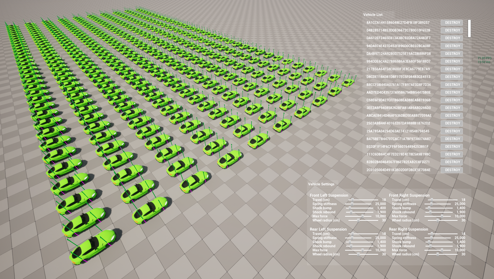
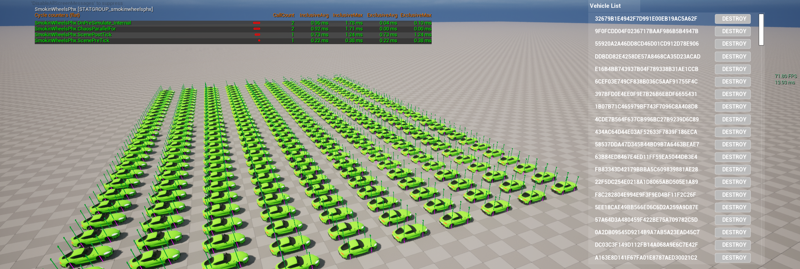

# Asynchronous vehicle physics in UE5 that scales with multithreading


I reworked the original [Async-Physics-Suspension](https://github.com/fgrenoville/Async-Physics-Suspension) project to simulate multiple vehicles in parallel, with a strict split between Game Thread (GT) and Physics Thread (PT) data to keep the plugin's workflow fully aligned with Unreal Engine 5 guidelines and best practices

Each vehicle owns its own input/output buffers and a PT-only internal state. All physics functionality now lives inside a dedicated plugin: SmokinWheelsPhx.




## What’s in this repo

- The SmokinWheelsPhx plugin (per-scene Chaos management, GT ↔ PT buffers, per-vehicle parallel step).
- A sample project with a tiny UI to quickly test features and compare single-thread vs parallel performance.


## Architecture at a glance

- Per-scene ownership: one manager per FPhysScene; it registers GT hooks (ScenePreTick, ScenePostTick) and the PT sim callback (OnPreSimulate_Internal).
- GT↔PT contract: GT writes Input, PT writes Output—they exchange packets via lock-free queues. No UObjects on PT.
- Identity & handles: FGuid routes data across threads; FUniqueIdx correlates the rigid body in the solver; handles are cached and validated each step.
- Parallelism: one vehicle = one iteration; each iteration reads/writes only its own slot → lock-free inner loop.


Tip: If you’re GPU/Render-bound, parallel physics improves capacity and stability but may not increase FPS. Use Unreal Insights / stat unit to confirm where the bottleneck is.


## Profiling & CVars

- Show plugin stats:
```text
stat SmokinWheelsPhx
```





- Toggle single-thread execution:
```text
swp.ForceSingleThread true   // single-thread path
swp.ForceSingleThread false  // Chaos::PhysicsParallelFor
```
- Toggle debug drawing:
```text
swp.DebugDraw.Enable true
swp.DebugDraw.Enable false
```
- Change line thickness scale:
```text
swp.DebugDraw.ThicknessScale 0..N   // e.g., swp.DebugDraw.ThicknessScale 1.5
```
- Filter drawings by category:

The plugin can filter debug drawing by category. Currently only Suspension is used, but other categories are already defined (e.g., Engine, Aero, Transmission).
```text
swp.DebugDraw.Cats [Suspension, Engine, Aero...]
```


## 📖 Related Article

This project is explained in detail in my Medium article:

👉 From one car to a fleet: asynchronous physics in UE5 that scales with multithreading (pending approval)


If you want to dive into the theory behind integration and physics in game engines, check out the previous article here:

👉 [Tick by Tick: How Unreal Engine Simulates Real-World Physics](https://levelup.gitconnected.com/tick-by-tick-how-unreal-engine-simulates-real-world-physics-4ac7bc9ee5fb)


## 🔧 Requirements

- Unreal Engine 5.4+

- C++ toolchain set up


## Contributing

❤️ If you find this useful, consider starring the repo. 

If you build something with it, drop a link — I’m happy to showcase community projects.

